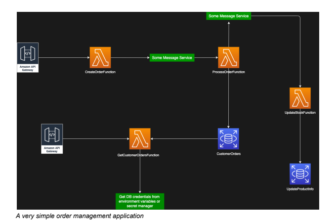

# Beam Ai Test



## FOR GET ORDER REQUEST 
    https://shc09ylrq3.execute-api.us-east-2.amazonaws.com/dev/order?email=customer1@example.com


## FOR POST REQUEST TO CREATE ORDER
```
curl --location 'https://shc09ylrq3.execute-api.us-east-2.amazonaws.com/dev/order' \
--header 'Content-Type: application/json' \
--data-raw '{
    "email":"customer1@example.com",
    "products":[{"id":1,"quantity":1}]
}'
```